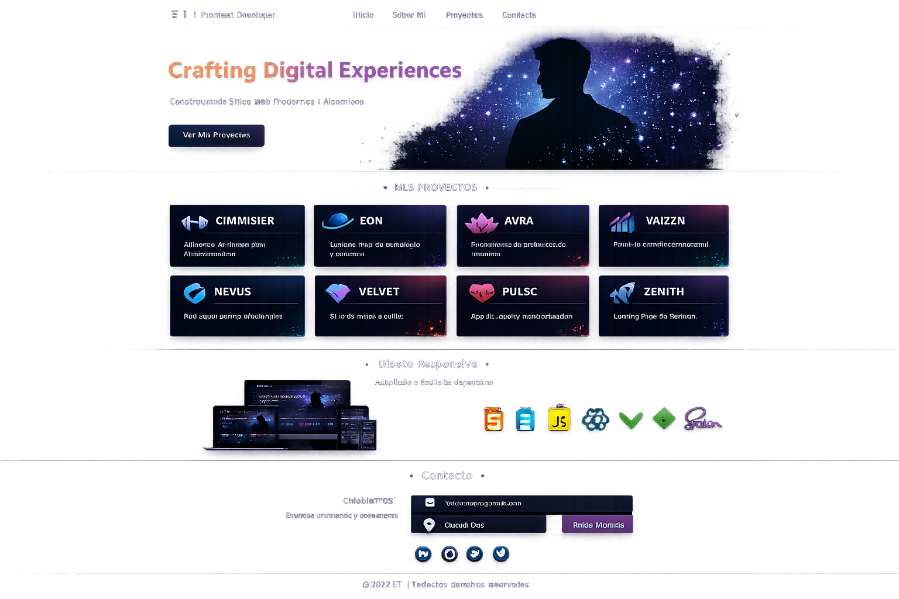
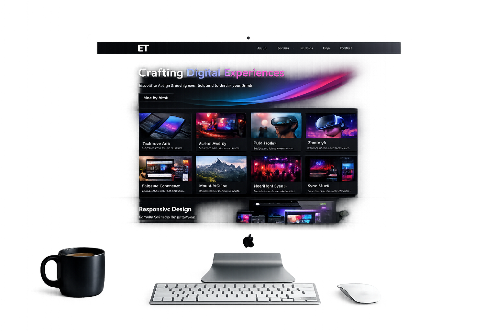
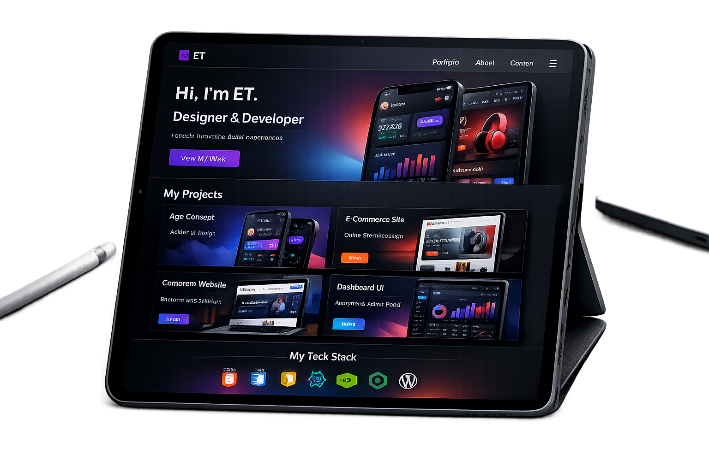
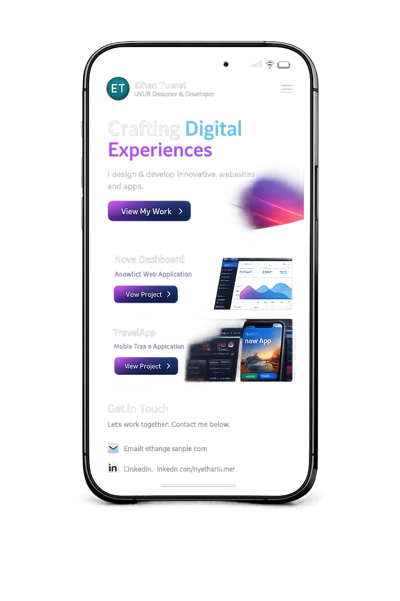
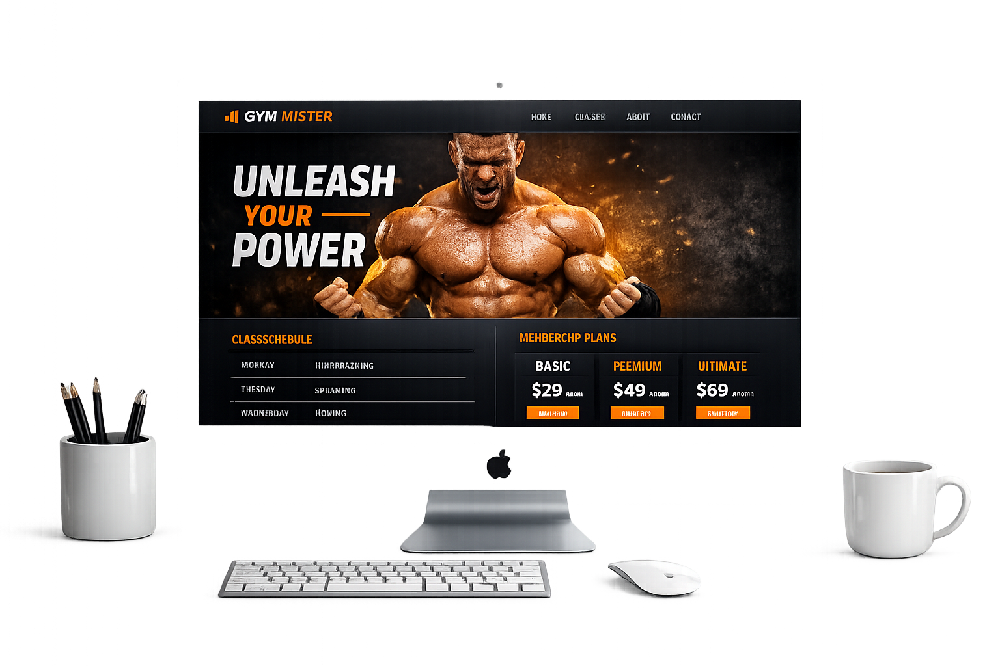
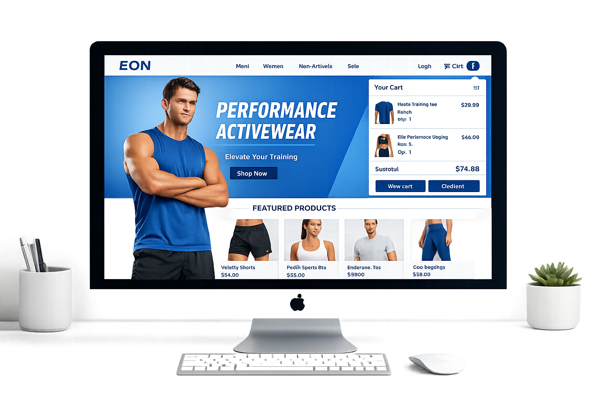

# Eddy Trejo | Software Engineering & High-End Design 🚀

  

> **Ingeniería de Sistemas aplicada al diseño de alto impacto. Soluciones Full-Stack robustas y estéticas premium. De Maracay para el mundo.**

Bienvenidos al repositorio de mi portafolio personal. Este proyecto no es solo una galería de trabajos, es una demostración técnica de la intersección entre el rendimiento óptimo del código y el diseño de interfaces (UI/UX) de calidad internacional.

## ✨ Características Destacadas

* **Estética Dark-Luxury:** Interfaz inmersiva con paleta de colores de alto contraste, tipografía editorial y uso estratégico de espacios negativos.
* **Arquitectura de Modales Dinámicos:** Sistema JavaScript limpio que inyecta casos de estudio profundos directamente en el DOM, permitiendo una navegación fluida sin recargar la página.
* **Animaciones y Canvas Interactivo:** Sistema de partículas renderizado en tiempo real y micro-interacciones creadas a medida para guiar la atención del usuario.
* **100% Responsivo:** Diseño fluido garantizado para adaptarse perfectamente desde pantallas ultrawide hasta dispositivos móviles.

## 💻 Tech Stack

Este portafolio fue construido priorizando el rendimiento y las buenas prácticas, prescindiendo de librerías pesadas innecesarias para la interfaz principal:

* **Estructura:** HTML5 Semántico.
* **Estilos:** Tailwind CSS (configurado a medida con animaciones y keyframes propios).
* **Lógica:** Vanilla JavaScript (ES6+).
* **Iconografía:** Devicons integrados.

## 📱 Vistas del Proyecto

El proyecto está diseñado meticulosamente para cualquier dispositivo:

### Desktop & Tablet

  
  

### Mobile

  

## 🚀 Proyectos Destacados (Casos de Estudio)

Dentro de la plataforma, he documentado con profundidad técnica más de 8 proyectos, detallando el reto, la solución, la paleta de colores y el stack utilizado. Algunos ejemplos integrados son:

* **GYM MISTER AMERICA:** Plataforma digital de alto rendimiento para un gimnasio premium.
* **EON ACTIVEWEAR:** E-commerce mobile-first con diseño radical minimalista.
* **AURA WELLNESS:** Plataforma de bienestar mental con animaciones fluidas y diseño terapéutico.
* **NEXUS TECH:** Dashboard analítico SaaS con visualización de datos complejos en tiempo real.

  
  

